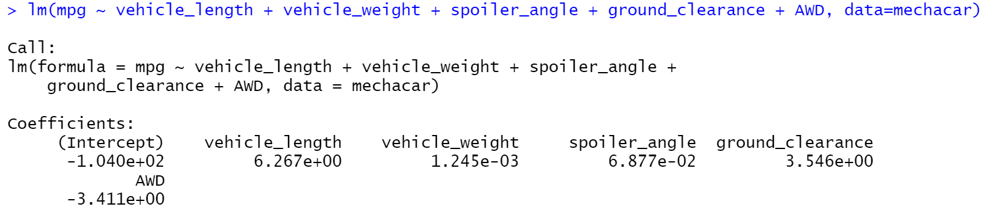
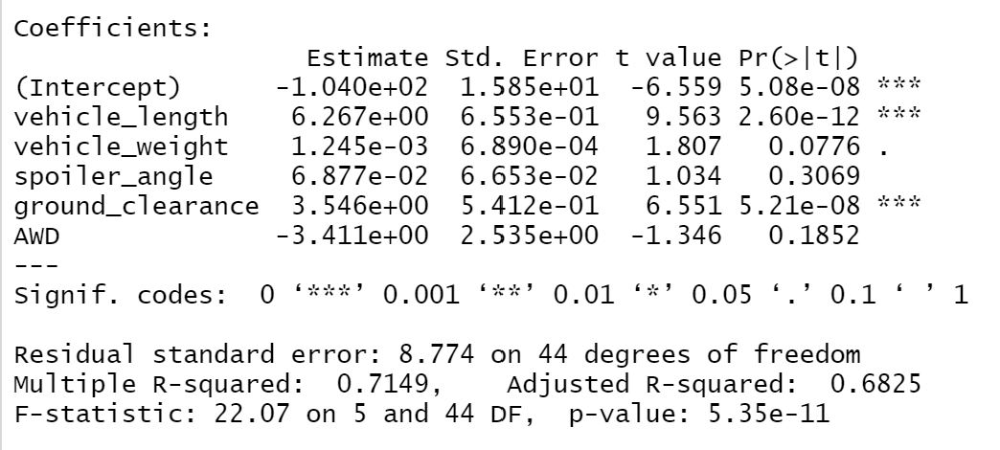
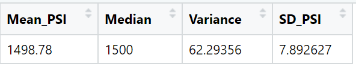
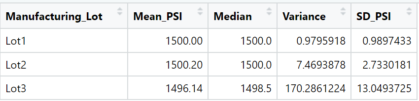
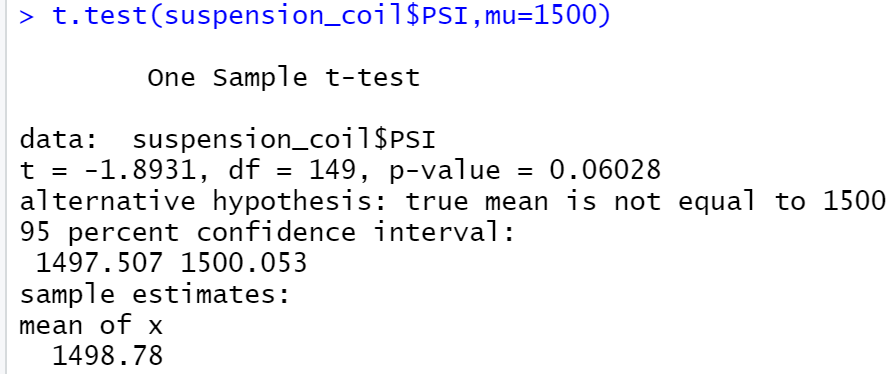
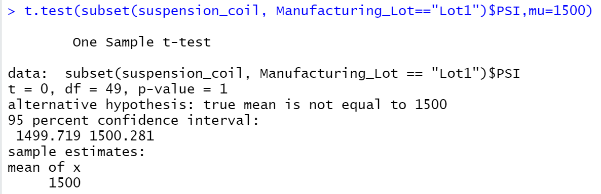
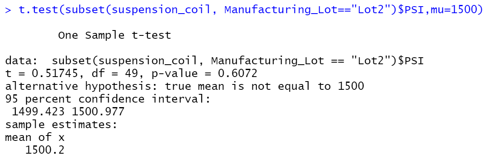
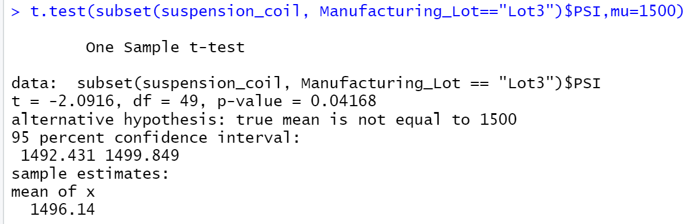

# MechaCar_Statistical_Analysis
Analysis to review the production data for insights that may help the manufacturing team to overcome production troubles.

# Purpose
AutoRU's is an automobile manufacturing company that wants to use this analysis to get better analysis of their workflow for successful automobile launches.

AutosRUs’ newest prototype, the MechaCar, is suffering from production troubles that are blocking the manufacturing team’s progress. Through this analysis we will review the production data for insights that may help the manufacturing team.

# Tools used :
We are using R for statistical modelling and hypothesis using the tidyverse and dplyr libraries.

# Results :
After running the analysis, we were able to answer some important questions related to the problems faced in the Mechacar prototye.

Aslo in Deliverable 4, we mentioned how we can take this analysis to an advancecd level by comparing vehicle performance of the MechaCar vehicles against vehicles from other manufacturers/competitors.

## Deliverable 1: Linear Regression to Predict MPG
Perform multiple linear regression analysis to identify which variables in the dataset predict the mpg of MechaCar prototypes

### Which variables/coefficients provided a non-random amount of variance to the mpg values in the dataset?

After running the code to create linear regression on multiple variables we got the following results. 

As per the cooeficients in the output, it shows that most of the variables provide a non-random amount of variance to the mpg values in the dataset.

### Is the slope of the linear model considered to be zero? Why or why not?

As per the above output, it proves that the slope of the liner model us not considered to be zero. 

As p-values of the variable vehicle length and ground_clearance are below 0.05, the slope cannot be considered zero.

### Does this linear model predict mpg of MechaCar prototypes effectively? Why or why not?
This module does not predict mpg of Mechacar prototypes effectively as there could be other variables responsible for the variance in the mpg.

## Deliverable 2: Summary Statistics on Suspension Coils (Visualizations for the Trip Analysis)

Collect summary statistics on the pounds per square inch (PSI) of the suspension coils from the manufacturing lots

The total summary dataframe below, shows the aggregated summary of all the lots together.

The mean PSI  is 1498.78, median PSI, variance 62.29 and standard deviation of 7.89 of all the lots aggregated together.

Also after running the summary for all lots, below are the results :

The result proves that all the lots have different values of variance and standard deviation.

#### The design specifications for the MechaCar suspension coils dictate that the variance of the suspension coils must not exceed 100 pounds per square inch. Does the current manufacturing data meet this design specification for all manufacturing lots in total and each lot individually? Why or why not?
The aggregated variance calculated for all lots together shows that the variance is 62.29 which is under 100 pounds per inch.

But when the results were checked lot wise, the variance of Lot 3 was way too high showing a variance of 170 pounds per inch.

## Deliverable 3: T-Tests on Suspension Coils
Run t-tests to determine if the manufacturing lots are statistically different from the mean population

Below is the summarized interpretation and findings for the t-test results. 

As we ran a one sample t-test on the whole data, we saw the following results:

The over all p-value is 0.06 which means the alternative hypothesis is true. 

After the above results we ran the t-test on each lot. The results for the Lot 1 are as follows :

The p-value of Lot 1 is 1, which means that the alternative hypothesis is true.

The results for the Lot 2 are as follows :

The p-value of Lot 2 is 0.6072, which means that the alternative hypothesis is true.

The results for the Lot 3 are as follows :

The p-value of Lot 2 is 0.04168, which means that the null hypothesis can be rejected.

## Deliverable 4: ## Study Design: MechaCar vs Competition
Design a statistical study to compare vehicle performance of the MechaCar vehicles against vehicles from other manufacturers. For each statistical analysis, you’ll write a summary interpretation of the findings.

As per the Mechacar data, we see that the Mechacar prototype has a variety of vehicles with a lot of variance in the variables of the vehicles and hence the mpg of each vehicle is directly or indirectly co-related to these variables.

In your description, address the following questions:

What metric or metrics are you going to test?
Firstly, we need data from multiple manufacturers for at least a couple of years to compare the linear regression from different cities in order to get a better understanding.

Additional metrics as follows would help :
1. Cost of vehicle - this can be the dependant variable or we can keep mpg as the dependant variable.
2. Horse power..Engines
3. Type of vehicle(Fuel, Electric or hybrid)
4. Weather in which the vehicle is tested(weather that imapct the road conditions like snow)
5. Area where the vehicle is tested(city, suburbs)
6. Yearly maintenance cost
7. Number of times maintenance is required in a year
8. All wheel drive or Front wheel drive
9. Safety rating

What is the null hypothesis or alternative hypothesis?

Null Hypothesis (Ho): MechaCar is priced correctly and its mpg is effective based on its performance of key factors for its genre. If the above variables have a p-value of 0.05 and above, hypothesis is null.

Alternative Hypothesis (Ha): MechaCar is NOT priced correctly and its mpg is not effective based on performance of key factors for its genre. If the above variables have a p-value of below 0.05, alternative hypothesis is true.

What statistical test would you use to test the hypothesis? And why?
We can do the Anova test to test if there a a statitical difference between the variables from multiple samples.

Also we can run a multiple linear regression to check the percentage of variance in the dependant variable.

What data is needed to run the statistical test?
Data from multiple manufacturers for at least a couple of years to compare the linear regression from different cities in order to get a better understanding of the linear regression model.

Also data of different lot sizes from different periods(different times of the year, to relate with weather conditions etc.) could give a better understanding.